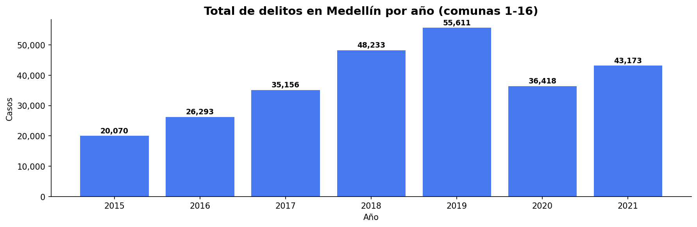
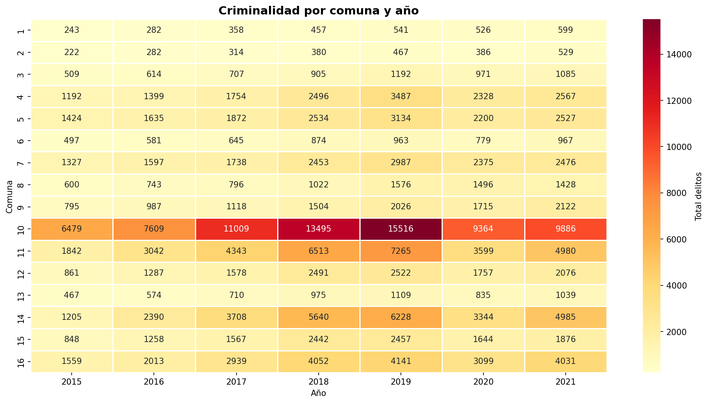
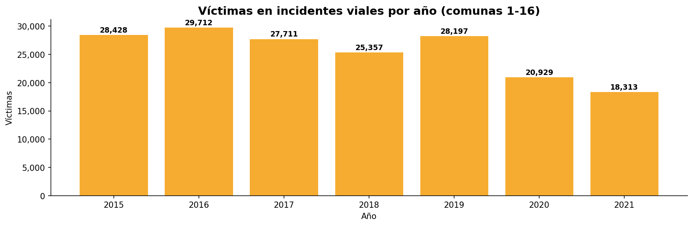
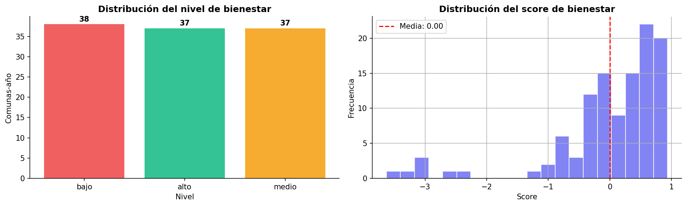
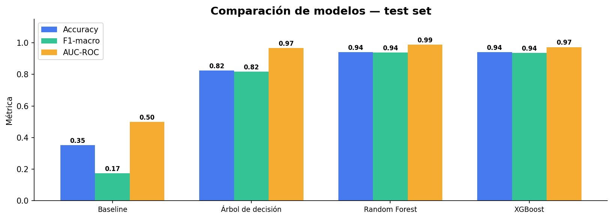
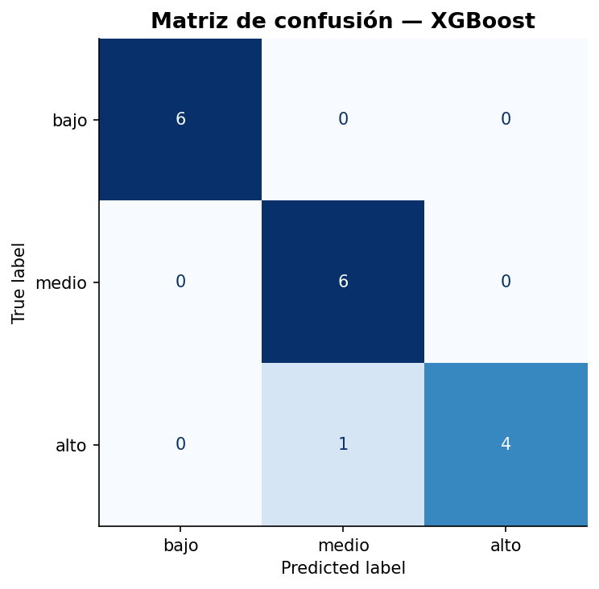
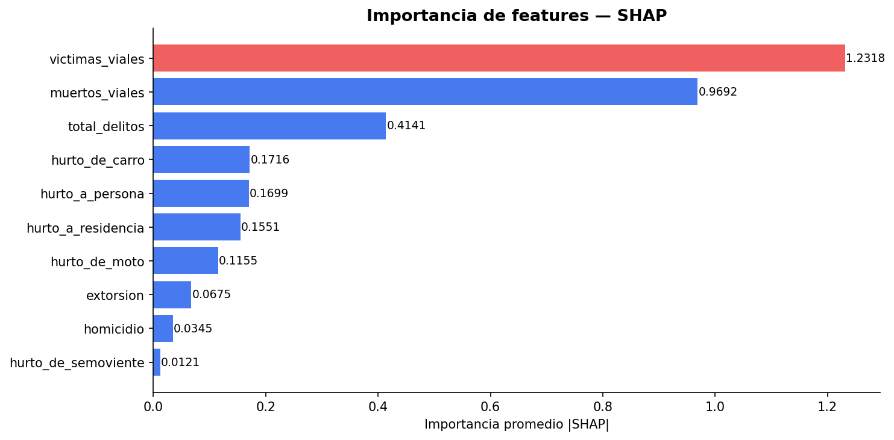

# MedellínVive — Predicción Inteligente de Bienestar Urbano por Comunas

> Proyecto Final de Inteligencia Artificial · Universidad EAFIT · 2026-1

---

## Descripción del Proyecto

**MedellínVive** es una plataforma de análisis urbano basada en Inteligencia Artificial que estima el nivel de bienestar de las 16 comunas de Medellín mediante el análisis de datos públicos abiertos de MEData.

El sistema integra información histórica de criminalidad e incidentes viales para generar indicadores predictivos y permitir consultas inteligentes en lenguaje natural usando un enfoque **RAG (Retrieval-Augmented Generation)**.

---

## Pregunta de Investigación

¿Puede un modelo de ML predecir el nivel de bienestar de una comuna de Medellín cruzando indicadores de criminalidad y accidentalidad vial, con un F1-macro superior al baseline, y puede un sistema RAG responder preguntas ciudadanas sobre esos datos con alta fidelidad?

---

## Objetivos

- Analizar y cruzar datos abiertos de Medellín relacionados con seguridad y movilidad.
- Construir un dataset consolidado por comunas (2015–2021).
- Entrenar modelos de ML para estimar niveles de bienestar urbano por comuna.
- Implementar un sistema RAG capaz de responder preguntas en lenguaje natural.
- Visualizar patrones y tendencias relevantes para el análisis urbano.

---

## Tecnologías Utilizadas

- Python 3.13+
- Pandas, NumPy
- Scikit-learn, XGBoost, SHAP
- Matplotlib, Seaborn
- LangChain, ChromaDB
- Groq API (LLaMA 3.1 — gratuito)
- Sentence Transformers (BAAI/bge-m3)
- Jupyter Notebook
- Git & GitHub

---

## Fuentes de Datos

Datos obtenidos desde **MEData** — portal de datos abiertos de la Alcaldía de Medellín.

| Dataset | Periodo | Fuente |
|---|---|---|
| Criminalidad por comunas | 2015–2023 | Secretaría de Seguridad SISC |
| Víctimas en incidentes viales | 2015–2021 | Secretaría de Movilidad |

> Los datasets originales no se incluyen en el repositorio por su tamaño.

---

## Arquitectura del Proyecto

```text
ProyectoFinal_IA/
│
├── data/
│   ├── raw/                 # Datos originales de MEData (no versionados)
│   └── processed/           # df_master_final.csv
│
├── notebooks/
│   ├── 01_eda.ipynb         # Análisis exploratorio de datos
│   ├── 02_modeling.ipynb    # Entrenamiento y evaluación de modelos
│   └── 03_rag.ipynb         # Sistema RAG con ChromaDB + Groq
│
├── reports/
│   └── figures/             # Visualizaciones generadas
│
├── src/                     # Módulos reutilizables
├── requirements.txt
├── README.md
└── .gitignore
```

---

## Instalación

```bash
# 1. Clonar el repositorio
git clone https://github.com/kevinqzg/ProyectoFinal_IA.git
cd ProyectoFinal_IA

# 2. Crear entorno virtual
python3 -m venv venv
source venv/bin/activate        # macOS/Linux
# venv\Scripts\activate         # Windows

# 3. Instalar dependencias
pip install -r requirements.txt
```

## Descarga de Datasets

Los datasets necesarios están disponibles en Google Drive:

[Descargar datasets del proyecto](https://drive.google.com/drive/folders/140SgmuC5wX05UDEZ-vrpldmsWGR0jQE-?usp=sharing)

Ubícalos en:

```text
data/raw/
├── consolidado_cantidad_casos_criminalidad_en_comunas_por_anio.csv
└── Mede_Victimas_inci.csv
```

---

## Ejecución

```bash
jupyter notebook
```

Orden recomendado:
1. `01_eda.ipynb` — EDA y construcción del dataset maestro
2. `02_modeling.ipynb` — Modelado ML con XGBoost + SHAP
3. `03_rag.ipynb` — Sistema RAG con ChromaDB + Groq

---

## Metodología

**Bloque 1 — EDA + Preprocesamiento:** cruce de datasets por (comuna, año), construcción del índice de bienestar compuesto, análisis de distribuciones y correlaciones.

**Bloque 2 — ML Clásico:** comparación de Baseline → Árbol de Decisión → Random Forest → XGBoost. Explicabilidad con SHAP.

**Bloque 3 — RAG:** indexación de datos en ChromaDB con embeddings BAAI/bge-m3. LLM LLaMA 3.1 vía Groq para respuestas en lenguaje natural. Evaluación con RAGAS.

---

## Resultados

### Análisis Exploratorio

**Criminalidad por año — comunas 1 a 16**


**Heatmap de criminalidad por comuna y año**


**Víctimas en incidentes viales por año**


**Variable objetivo — nivel de bienestar**


---

### Modelado

**Comparación de modelos**


**Matriz de confusión — XGBoost**


**Importancia de features — SHAP**


---

## Equipo

| Integrante | Rol |
|---|---|
| Kevin Quiroz González | EDA, preprocesamiento, modelado |
| Carlos Alberto Mazo Gil | RAG, evaluación, informe |

---

## Licencia

Proyecto desarrollado con fines académicos — Inteligencia Artificial, Universidad EAFIT 2026-1.